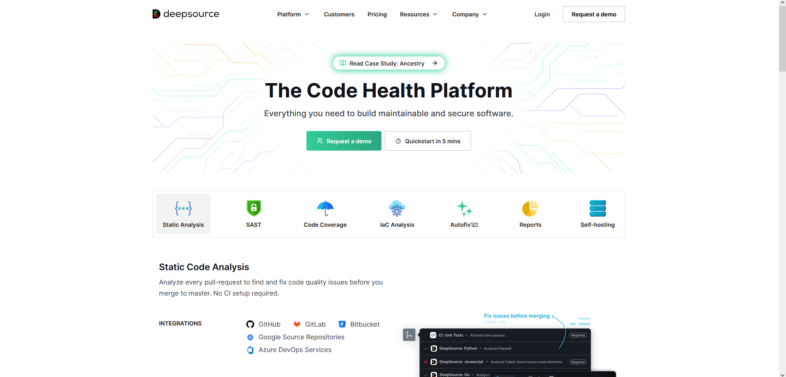
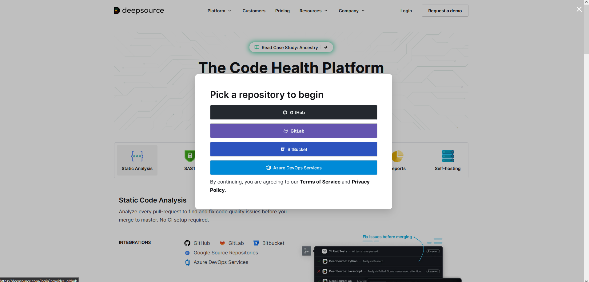
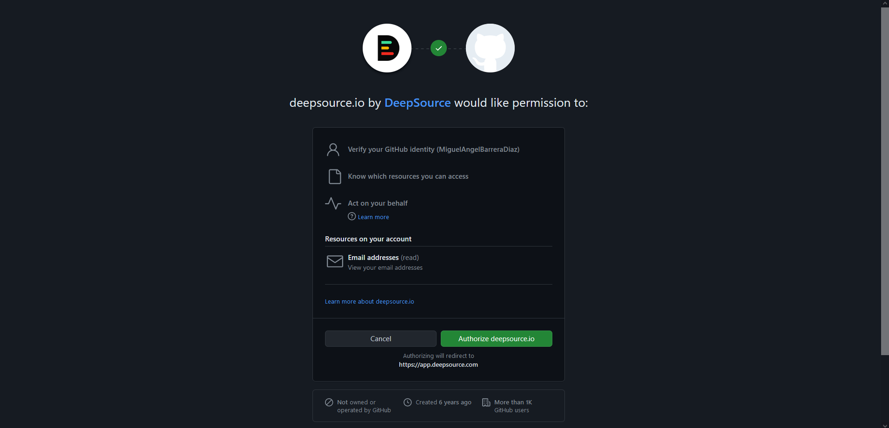
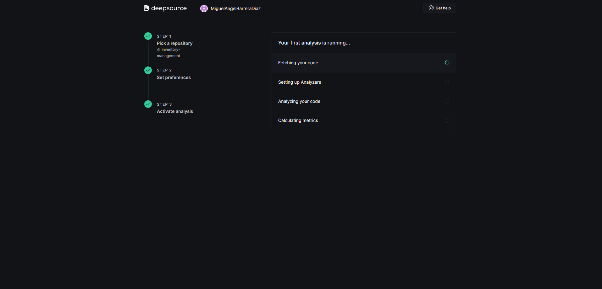
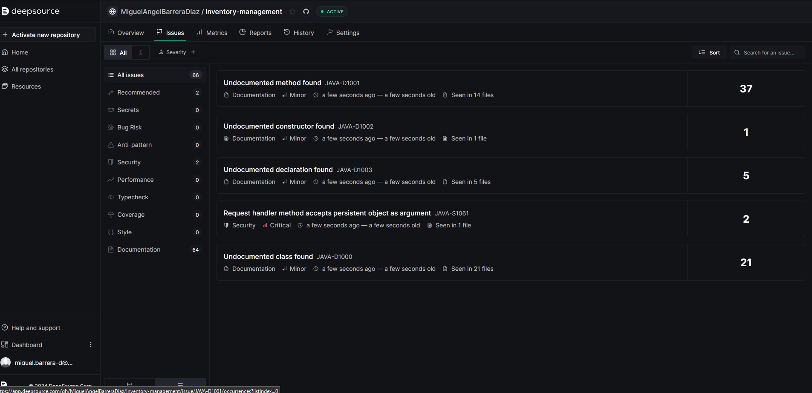
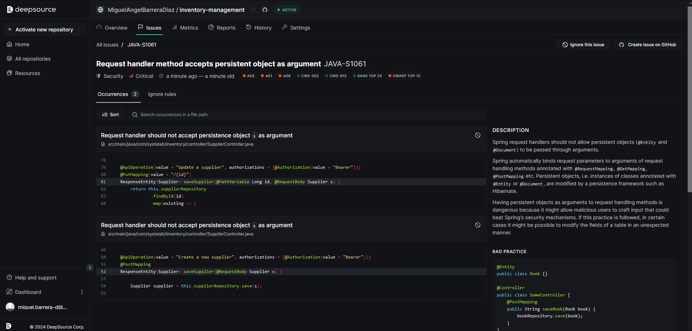
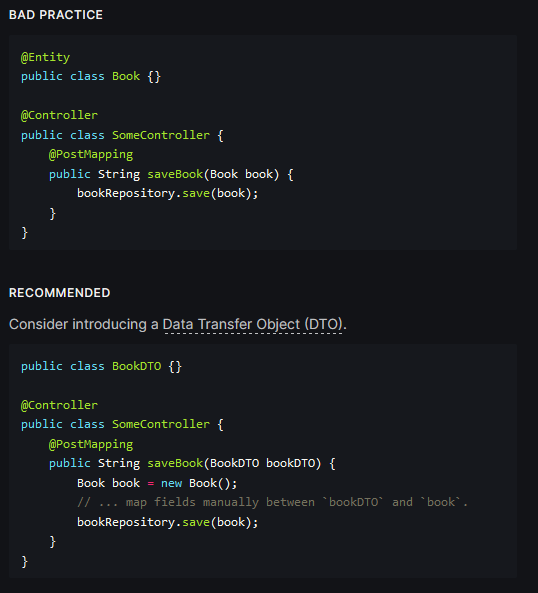

# Análisis inventory-management

El documento consolida y complementa los análisis y entregas realizados anteriormente en el curso, abordando temas de calidad del código, principios de programación, prácticas ágiles, pruebas unitarias y la incorporación de herramientas de IA para mejorar el proceso de desarrollo de software.

## Análisis de Code Smells y Técnicas de Refactorización

A partir del análisis del código fuente proporcionado, se identificaron varios code smells y se sugirieron técnicas de refactorización correspondientes para cada uno de ellos. A continuación, se presenta un resumen de los principales hallazgos:

### Configuración (config)

- En la clase WebSecurityConfig, se detectaron problemas de complejidad excesiva y violación del principio de abierto/cerrado. Se recomendó separar las responsabilidades en clases más pequeñas y cohesivas, y aplicar el patrón de diseño Estrategia para permitir la extensión de la configuración de seguridad sin modificar la clase principal.

- En la clase TokenProvider, se encontraron code smells relacionados con complejidad innecesaria, duplicación de código, falta de encapsulamiento y nombres de métodos poco descriptivos. Las técnicas de refactorización sugeridas incluyen la extracción de métodos más pequeños y expresivos, la identificación y eliminación de código duplicado, el encapsulamiento de campos y la mejora de los nombres de los métodos.

### Controladores (controller)

- En la clase UserController, se identificaron métodos demasiado largos y una violación del principio de responsabilidad única. Se recomendó extraer métodos más pequeños con responsabilidades únicas y separar las funcionalidades de autenticación y manejo de usuarios en clases diferentes.

- En las clases SupplierController y WarehouseController, se detectó duplicación de código y falta de encapsulamiento. Las técnicas de refactorización sugeridas incluyeron la extracción de una clase base o interfaz común para la funcionalidad compartida y el uso de métodos de acceso (getters y setters) en lugar de acceder directamente a los campos.

### Modelos (model)

- En las clases Item, Order, OrderLine y Product, se identificó el code smell de "clases con demasiados atributos". Se recomendó aplicar el patrón de diseño Extract Class o crear clases más pequeñas y cohesivas para separar responsabilidades.

- En la clase Product, también se encontraron relaciones bidireccionales, campos y atributos poco descriptivos. Las técnicas de refactorización sugeridas incluyeron el uso de relaciones unidireccionales siempre que sea posible y el renombramiento de campos y atributos con nombres más descriptivos.

- En las clases Supplier y Warehouse, se identificaron problemas de relaciones bidireccionales y uso de colecciones sin tipo genérico. Se recomendó utilizar relaciones unidireccionales y tipos genéricos para mejorar la seguridad y la legibilidad del código.

## Evaluación de Características de Clean Code

Se realizó una evaluación de las características de Clean Code en el código proporcionado, donde se analizaron aspectos como el enfoque del código, la legibilidad, la escalabilidad, la duplicidad, la abstracción y la facilidad para realizar pruebas. A continuación, se presentan los resultados:
Controladores (controller)

- Las clases SupplierController, WarehouseController y SupplierNotFoundException cumplen con las características de código enfocado, entendible y sin duplicidad de código.

- La clase UserController cumple parcialmente con las características de entendibilidad y abstracción, ya que podría mejorarse la legibilidad y la documentación, y algunos métodos son demasiado largos.

- No se pudo determinar si se cumplen las características de escalabilidad y facilidad para realizar pruebas debido a la falta de información sobre la adherencia a principios de diseño y la presencia de pruebas unitarias y de aceptación.

### Modelos (model)

En general, las clases del modelo cumplen con las características de código enfocado y sin duplicidad de código.
La mayoría de las clases cumplen parcialmente con la característica de entendibilidad, ya que los nombres de las clases y atributos son descriptivos, pero hay oportunidades de mejora en la documentación y el uso de comentarios TODO.
No se pudo determinar si se cumplen las características de escalabilidad y facilidad para realizar pruebas debido a la falta de información sobre la adherencia a principios de diseño y la presencia de pruebas unitarias y de aceptación.
Algunas clases, como Item, cumplen parcialmente con la característica de abstracción, ya que tienen métodos complejos que podrían dividirse en métodos más pequeños.

## Evaluación de Principios de Programación

Se evaluó el cumplimiento de los principios de programación SOLID y otros principios relevantes en el código proporcionado. A continuación, se presentan los resultados:
Controladores (controller)

- La clase SupplierController no cumple completamente con el principio de Responsabilidad Única (SRP) y el principio Don't Repeat Yourself (DRY) debido a la duplicidad de código encontrada en los métodos findOneSupplier y existSupplier.

- La clase UserController podría no cumplir completamente con el principio KISS (Keep It Simple, Stupid) debido a la presencia de métodos relativamente largos, como authenticateUser.
    
- No se pudo determinar si se cumple con el principio YAGNI (You Ain't Gonna Need It) debido a la falta de información sobre la implementación de funcionalidades innecesarias.

### Modelos (model)

No se identificaron violaciones evidentes de los principios de programación en las clases del modelo.

## Prácticas XP

Se propuso la implementación de prácticas ágiles de Extreme Programming (XP) para mejorar la calidad del código y el flujo de trabajo del proyecto:

- Desarrollo Guiado por Pruebas (TDD): Escribir pruebas unitarias antes de desarrollar el código de producción para asegurar que cada componente esté exhaustivamente probado y contribuir a la mejora continua de la calidad del código.

- Integración Continua: Establecer un sistema de integración continua que ejecute automáticamente pruebas cuando se realicen cambios en el código fuente, permitiendo identificar y abordar rápidamente posibles problemas de integración y errores.

- Diseño Simple: Abogar por un diseño simple en el proceso de refactorización, siguiendo el principio KISS (Keep It Simple) para evitar la complejidad innecesaria y mantener el código claro y accesible.

- Despliegue Continuo: Explorar prácticas de Despliegue Continuo para entregar de manera rápida y eficiente nuevas características y correcciones de errores al entorno de producción, contribuyendo así a una evolución continua y ágil del proyecto.

## Testing Debt

Se diseñaron y ejecutaron pruebas unitarias sobre clases consideradas fundamentales para garantizar el correcto funcionamiento del programa. Estas pruebas se enfocaron en verificar el comportamiento esperado de las funciones esenciales de las clases, asegurando que cumplan con los requisitos de negocio y mantengan la integridad y confiabilidad del sistema.Pruebas en controladores (controller):

- ApplicationControllerTest: Pruebas para verificar el correcto funcionamiento de los métodos initSomeData en casos de éxito, fracaso y manejo de excepciones.
- SupplierControllerTest: Pruebas para verificar la creación, actualización y eliminación de proveedores.
- UserControllerTest: Pruebas para verificar la autenticación de usuarios y el manejo adecuado de credenciales inválidas y usuarios no encontrados.
- WarehouseControllerTest: Pruebas para verificar la generación de informes de almacenes y la obtención correcta de almacenes.

### Pruebas en modelos (model)

ItemTest: Pruebas para verificar el correcto funcionamiento del método fillQuarantineLotInfo en diferentes escenarios de gestión de cuarentena de artículos.

### Pruebas en servicios (services)

AppUserDetailsServiceTest: Pruebas para verificar la carga correcta de los detalles de los usuarios para su autenticación y el manejo adecuado de usuarios no encontrados.

## Propuestas de Herramientas de IA

### Herramientas de análisis estático de código

**DeepSource:** DeepSource es una herramienta de análisis estático de código basada en IA que utiliza técnicas de aprendizaje automático para detectar problemas de calidad, seguridad y rendimiento en el código fuente. Puede analizar múltiples lenguajes de programación y proporcionar sugerencias de refactorización y correcciones de código.

### Proceso:

1. Ingresar a la plataforma web de DeepSource (https://deepsource.com/) y hacer clic en el botón "Quickstart in 5 mins" para para comenzar.
   
2. Ingresar con nuestra cuenta de GitHub
   
3. Otorgar los permisos necesarios a DeepSource para acceder a tu repositorio de código fuente.
   
4. Una vez seleccionado el repositorio, DeepSource comenzará a analizar el código fuente utilizando su motor de análisis estático basado en Inteligencia Artificial.
   
5. Después de completar el análisis, DeepSource mostrará una lista detallada de los problemas o issues encontrados en tu código. Esta lista incluirá tanto problemas de documentación como de seguridad, rendimiento y otros aspectos relacionados con la calidad del código.
   
6. Para cada issue identificado, DeepSource proporcionará información valiosa, incluyendo:

   - El fragmento de código específico donde se encuentra el problema.
   - Una descripción clara del issue y su impacto potencial.
     -  
   - Un ejemplo de la mala práctica detectada y una recomendación o sugerencia para corregir o refactorizar el código y resolver el issue.
     * 

     
## Conclusiones

* El análisis realizado en este proyecto ha permitido identificar diversos code smells y oportunidades de refactorización en el código fuente. Se han evaluado las características de Clean Code, los principios de programación y se han propuesto prácticas ágiles como el Desarrollo Guiado por Pruebas, la Integración Continua y el Diseño Simple para mejorar la calidad del código y el flujo de trabajo del proyecto.

* Además, se han diseñado y ejecutado pruebas unitarias sobre clases fundamentales para garantizar el correcto funcionamiento del programa y reducir la deuda técnica. Estas pruebas son esenciales para mantener la integridad y confiabilidad del sistema a medida que se realizan cambios y refactorizaciones.

* Por último, se han propuesto una herramienta de Inteligencia Artificial, DeepSource. Esta herramienta basada en IA puede proporcionar análisis más precisos y sugerencias de refactorización más acertadas, aunque es importante utilizarlas en conjunto con la revisión y el criterio de los desarrolladores.

