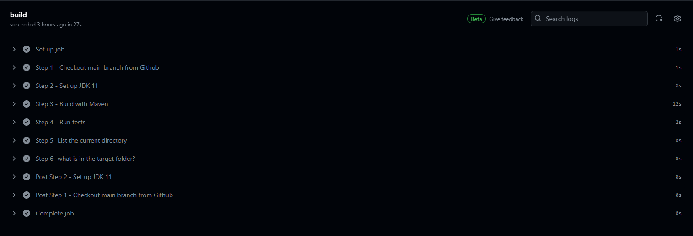
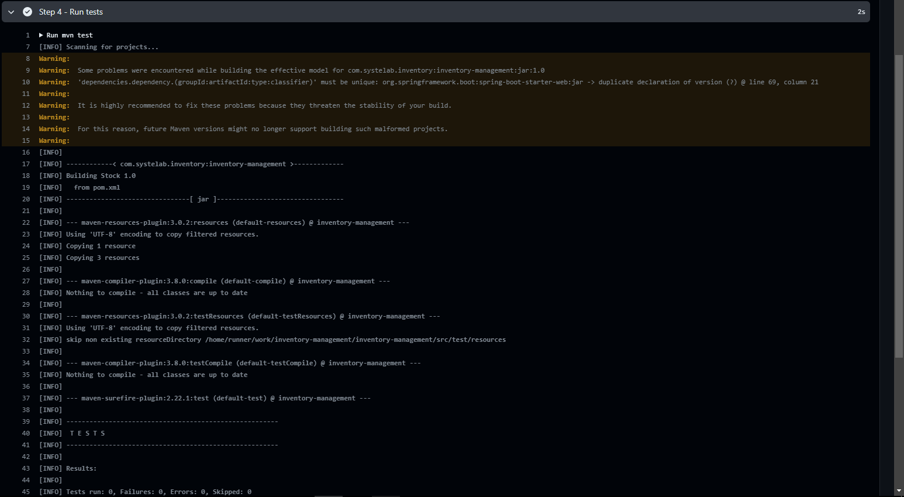

# Continuous Integration
En este archivo se documentará el proceso de integración continua en nuestro proyecto.

> [!NOTE]
> Para obtener más información sobre el proyecto y los cambios realizados, consulte los archivos md: semlls, TestingDebt, CSDT-2024.md.


## ¿Qué es? 

La integración continua es una práctica en el desarrollo de software que consiste en fusionar regularmente los cambios realizados por los miembros de un equipo en un repositorio compartido. Este proceso implica la automatización de pruebas y análisis de código para detectar errores tempranamente y garantizar que el código integrado funcione correctamente y cumpla con los estándares de calidad establecidos. En resumen, la integración continua busca mantener una base de código estable y lista para ser desplegada en cualquier momento.

## Configuración

Se está especificando que el flujo se ejecutará cuando se realice un push hacia el repositorio remoto, pero solo en la rama master.

```yml
    on:
      push:
        branches: [ master ]
```

## Compilación:
El propósito de esta sección es compilar el código fuente del proyecto utilizando Maven y asegurarse de que se construya correctamente.

**Step 1** - Checkout main branch from Github:

Este paso utiliza la acción checkout para clonar el repositorio de GitHub y recuperar el contenido de la rama principal (master en este caso) en la máquina virtual de GitHub Actions.
```yml
    - name: Step 1 - Checkout main branch from Github
      uses: actions/checkout@v3
```

**Step 2** - Set up JDK 11:

Utiliza la acción setup-java para configurar JDK 11 en la máquina virtual de GitHub Actions. Se especifica que se utilice la distribución 'adopt' de JDK 11.
```yml
    - name: Step 2 - Set up JDK 11
      uses: actions/setup-java@v3
      with:
        java-version: 11
        distribution: 'adopt'
```

**Step 3** - Build with Maven:

Utiliza el comando mvn clean install para ejecutar la fase de compilación del proyecto Maven. Esto limpia el proyecto (clean) y luego compila e instala (install) las dependencias y artefactos del proyecto en el repositorio local de Maven.

```yml
    - name: Step 3 - Build with Maven
        run: mvn clean install
```

## Pruebas:
El propósito de esta sección es ejecutar las pruebas unitarias del proyecto para garantizar que el código funcione según lo previsto.

**Step 4** - Run tests:

Utiliza el comando mvn test para ejecutar las pruebas unitarias del proyecto Maven. Esto ejecuta todas las pruebas definidas en el proyecto y proporciona información sobre si las pruebas pasan o fallan.
```yml
    - name: Step 4 - Run tests
      run: mvn test
```

## Pasos adicionales

**Step 5** - List the current directory:

Ejecuta el comando ls -a para listar todos los archivos y directorios en el directorio actual. Este paso podría ser útil para verificar el entorno de ejecución y los archivos generados durante la compilación y las pruebas.
```yml
    - name: Step 5 -List the current directory
      run: ls -a
```

**Step 6** - What is in the target folder?:

Utiliza una secuencia de comandos para cambiar al directorio target (que es donde Maven normalmente coloca los archivos compilados y los artefactos generados) y luego listar su contenido con ls -a. Esto proporciona información sobre los archivos generados durante el proceso de compilación y las pruebas, como los archivos JAR o WAR resultantes.

```yml
    - name: Step 6 -what is in the target folder?
      run: |
        cd target 
        ls -a
```

## Proceso de Ejecución

La visualización de la ejecución de la integración continua en Github se muestra a continuación:



### Proceso de Compilación:

La siguiente imagen muestra cómo se ve el proceso de compilación en Github:


La siguiente imagen muestra cómo se ve la ejecución de las pruebas unitarias en Github Actions:



> [!IMPORTANT]
> No se pudo realizar el análisis de código en el proyecto debido a restricciones de permisos dentro de la organización. Sin embargo, a continuación se proporcionará una guía paso a paso de cómo debería realizarse este proceso.

## Code Analysis

### Pasos a seguir

1. Crear una cuenta en SonarCloud:
Si aún no tienes una cuenta en SonarCloud, regístrate en SonarCloud y crea un proyecto para tu aplicación.

2. Generar un token de acceso en SonarCloud:
Genera un token de acceso en SonarCloud que será utilizado por GitHub Actions para enviar los resultados del análisis. Puedes generar un token desde tu cuenta de usuario en SonarCloud, en la sección de "Tokens".

3. Agregar el token de acceso en los secretos de GitHub:
En la configuración de tu repositorio en GitHub, ve a la sección de "Secretos" y agrega el token de acceso de SonarCloud como un nuevo secreto, por ejemplo, con el nombre SONAR_TOKEN.

4. Configurar el archivo YAML de integración continua:
Aquí está un ejemplo de cómo puedes configurar el archivo YAML para realizar el análisis con SonarCloud:


> [!TIP]
> Reemplaza <sonar-project-key> con la clave de tu proyecto en SonarCloud.

> [!TIP]
> Reemplaza <organization-key> con la clave de tu organización en SonarCloud.

```yml
    name: SonarCloud Analysis

    on:
    push:
        branches: [ master ]

    jobs:
      sonarcloud:
        runs-on: ubuntu-latest
        steps:
        - name: Checkout main branch
        uses: actions/checkout@v2
        
        - name: Set up JDK 17
        uses: actions/setup-java@v2
        with:
            java-version: 17

        - name: SonarCloud Scan
        env:
            GITHUB_TOKEN: ${{ secrets.GITHUB_TOKEN }}
            SONAR_TOKEN: ${{ secrets.SONAR_TOKEN }}
        run: mvn sonar:sonar -Dsonar.projectKey=<sonar-project-key> -Dsonar.organization=<organization-key> -Dsonar.host.url=https://sonarcloud.io -Dsonar.login=${SONAR_TOKEN}

```