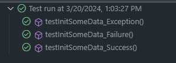
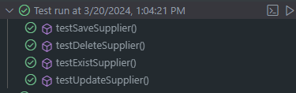
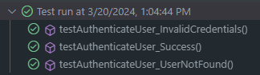
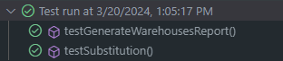
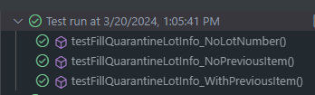

# Testing Debt

Los tests fueron diseñados y ejecutados sobre clases consideradas fundamentales para garantizar el correcto funcionamiento del programa. Cada conjunto de pruebas se enfocó en verificar el comportamiento esperado de las funciones esenciales de las clases, asegurando que cumplan con los requisitos de negocio y mantengan la integridad y confiabilidad del sistema. Estas pruebas no solo son indispensables para identificar y corregir posibles errores o fallos en las funcionalidades críticas del programa, sino que también contribuyen significativamente a la reducción de la deuda técnica a medida que el proyecto avanza. Al refactorizar el código, estas pruebas actúan como salvaguardas para garantizar que los cambios realizados no introduzcan nuevos problemas y que el software mantenga su calidad y estabilidad a lo largo del tiempo.

## Test en controllers

### ApplicationControllerTest

Este conjunto de pruebas se enfoca en la clase ApplicationController, que controla las operaciones relacionadas con la aplicación en general. Los métodos initSomeData son probados para asegurar que devuelvan los resultados esperados en casos de éxito y fracaso, y también que manejen excepciones correctamente.

    ´´´ 
    Test implementados:

    testInitSomeData_Success: Verifica que el método initSomeData del controlador devuelva verdadero cuando la inicialización de datos tiene éxito.

    testInitSomeData_Failure: Verifica que el método initSomeData del controlador devuelva falso cuando la inicialización de datos falla.

    testInitSomeData_Exception: Verifica que el método initSomeData del controlador lance una excepción de NullPointerException cuando la inicialización de datos genera esa excepción.

     ´´´
 

### SupplierControllerTest

Este conjunto de pruebas se centra en la clase SupplierController, que maneja las operaciones relacionadas con los proveedores. Se prueban diferentes métodos para asegurar que funcionen correctamente, incluyendo la creación, actualización, y eliminación de proveedores.

    ´´´ 
    Test implementados:

    testSaveSupplier: Verifica que el método saveSupplier del controlador guarde un proveedor correctamente y devuelva una respuesta de estado CREATED.

    testDeleteSupplier: Verifica que el método deleteSupplier del controlador elimine un proveedor correctamente y devuelva una respuesta de estado NO_CONTENT.

    testExistSupplier: Verifica que el método existSupplier del controlador devuelva una respuesta de estado NO_CONTENT si un proveedor existe.

    testUpdateSupplier: Verifica que el método saveSupplier del controlador actualice un proveedor correctamente y devuelva una respuesta de estado CREATED.
    ´´´ 

### UserControllerTest

Este conjunto de pruebas se enfoca en la clase UserController, que maneja las operaciones relacionadas con los usuarios del sistema. Se prueban los métodos relacionados con la autenticación de usuarios.
    
    ´´´ 
    Test implementados:

    testAuthenticateUser_Success: Verifica que el método authenticateUser del controlador autentique un usuario correctamente y devuelva un token de acceso.

    testAuthenticateUser_InvalidCredentials: Verifica que el método authenticateUser del controlador maneje adecuadamente las credenciales de usuario incorrectas, lanzando una excepción de BadCredentialsException.

    testAuthenticateUser_UserNotFound: Verifica que el método authenticateUser del controlador maneje adecuadamente el caso en el que no se encuentre un usuario, devolviendo un código de estado UNAUTHORIZED.

    ´´´ 

### WarehouseControllerTest

Este conjunto de pruebas se centra en la clase WarehouseController, que controla las operaciones relacionadas con los almacenes. Las pruebas se centran en verificar que los métodos de generación de informes y obtención de almacenes funcionen correctamente.

    ´´´ 
    Test implmentados:

    testGenerateWarehousesReport: Verifica que el método generateWarehousesReport del controlador devuelva una lista de almacenes con el tamaño esperado.

    testSubstitution: Verifica que el método substition del controlador devuelva una página de almacenes con los parámetros de paginación correctos y el tamaño esperado.

    ´´´ 

## Test en model

### ItemTest
Estas pruebas aseguran que el método fillQuarantineLotInfo funcione correctamente en diferentes escenarios, ayudando así a garantizar el comportamiento esperado del sistema en relación con la gestión de la cuarentena de los artículos.
    
    ´´´
    Test implementados:

    testFillQuarantineLotInfo_NoLotNumber: Verifica que cuando el número de lote del artículo es nulo, el artículo no esté en cuarentena y tanto la fecha de inicio como la fecha de fin de la cuarentena también sean nulas.

    testFillQuarantineLotInfo_NoPreviousItem: Verifica que cuando no hay un artículo previo (anterior) relacionado, el artículo no esté en cuarentena y que la fecha de fin de la cuarentena sea nula.

    testFillQuarantineLotInfo_WithPreviousItem: Verifica que cuando hay un artículo previo relacionado, el artículo actual no esté en cuarentena, pero la fecha de fin de la cuarentena sea no nula. Esto indica que la cuarentena del artículo actual ha terminado y la fecha de fin se establece en base a la fecha de inicio de la cuarentena del artículo previo.

    ´´´

## Test en services

### AppUserDetailsService

Estas pruebas garantizan que el servicio AppUserDetailsService funcione correctamente al cargar los detalles de los usuarios para su autenticación, asegurando que se manejen adecuadamente los casos de éxito y de usuario no encontrado.

    ´´´
    testLoadUserByUsername: Esta prueba verifica que el método loadUserByUsername cargue correctamente los detalles de un usuario cuando se proporciona un nombre de usuario válido. Se establece un usuario de prueba con un rol "ROLE_USER" y se configura el comportamiento esperado del repositorio de usuarios utilizando Mockito. Luego, se invoca el método loadUserByUsername con el nombre de usuario del usuario de prueba y se verifican los detalles cargados, incluyendo el nombre de usuario, la contraseña y el rol asignado.

    testLoadUserByUsernameNotFound: Esta prueba verifica que el método loadUserByUsername lance una excepción UsernameNotFoundException cuando se proporciona un nombre de usuario que no existe en el sistema. Se configura el repositorio de usuarios para devolver nulo cuando se busca el nombre de usuario inexistente utilizando Mockito, y luego se invoca el método loadUserByUsername con ese nombre de usuario. Se espera que se lance una excepción UsernameNotFoundException.

    ´´´

    
